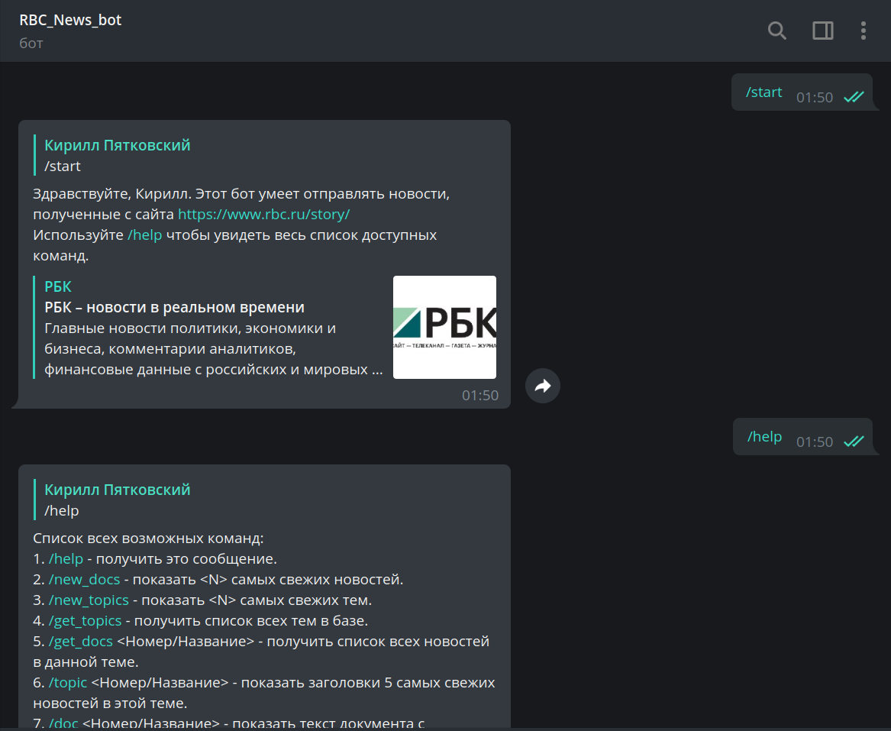
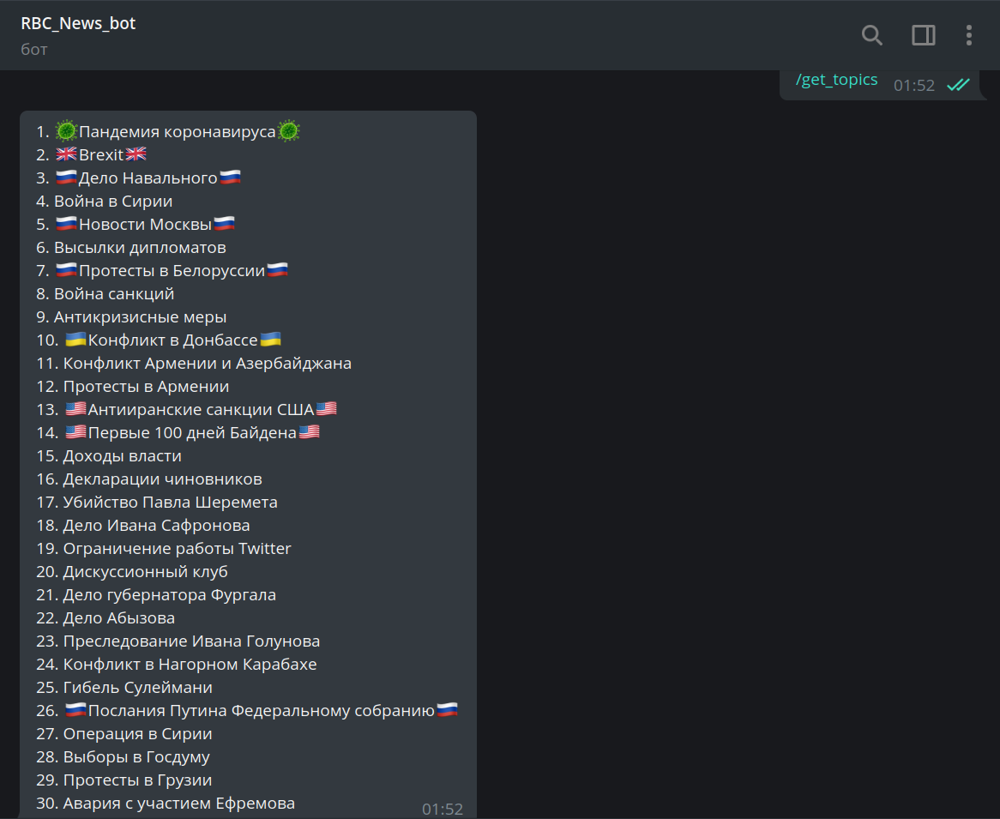
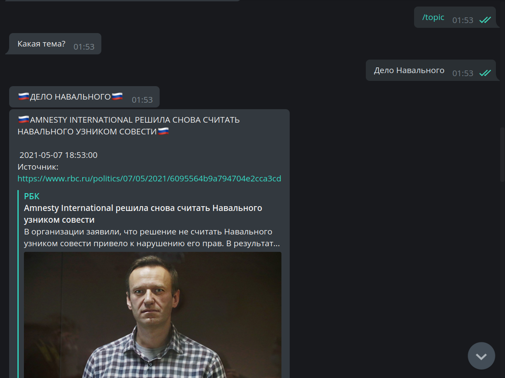
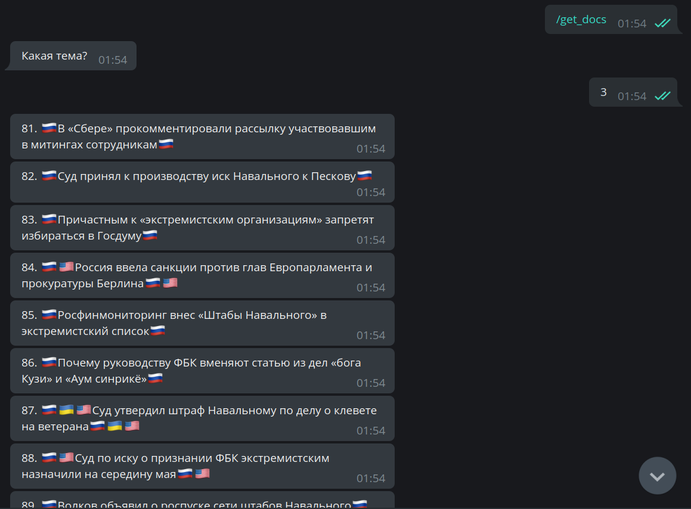
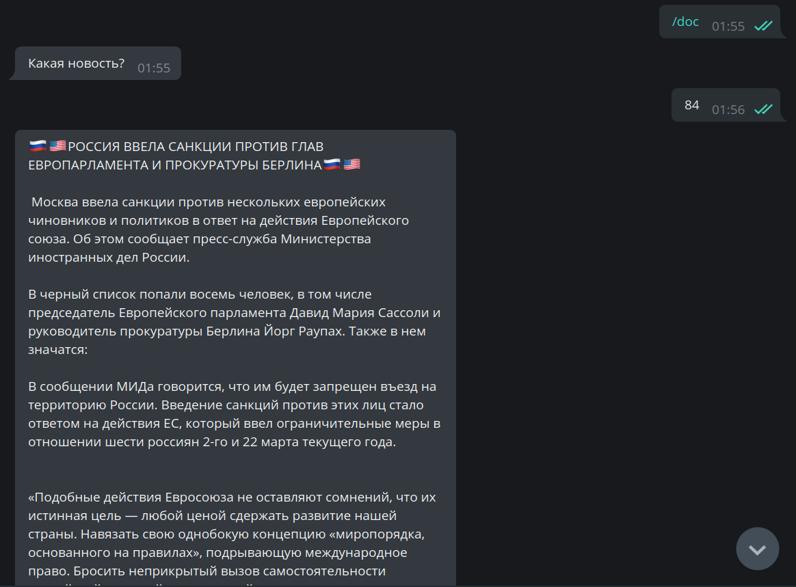
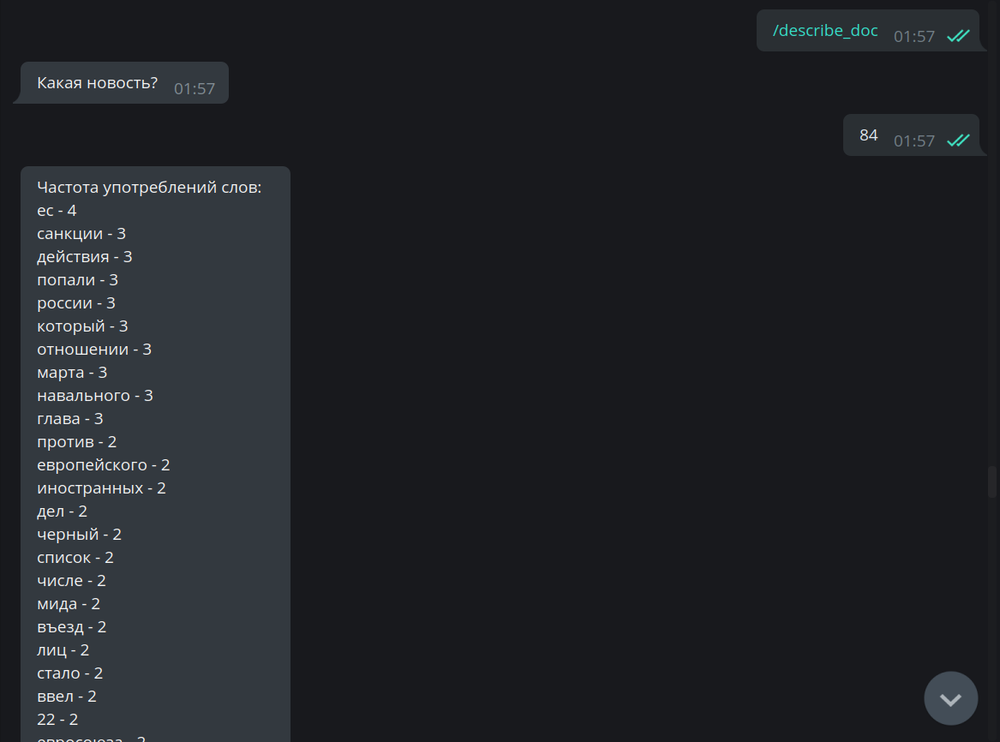
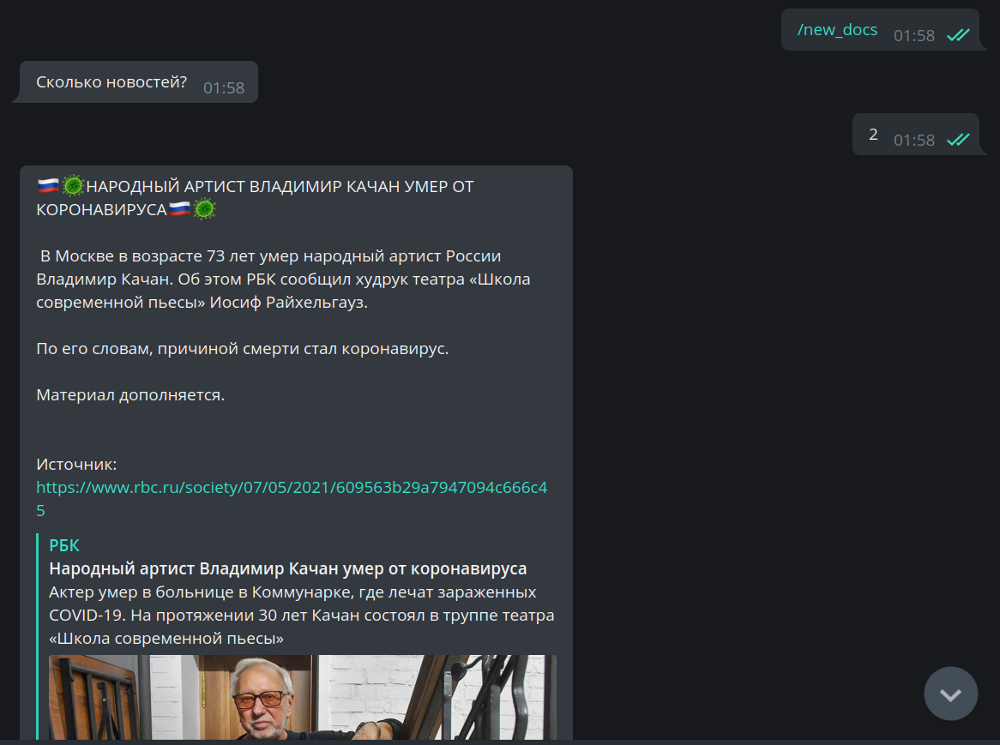
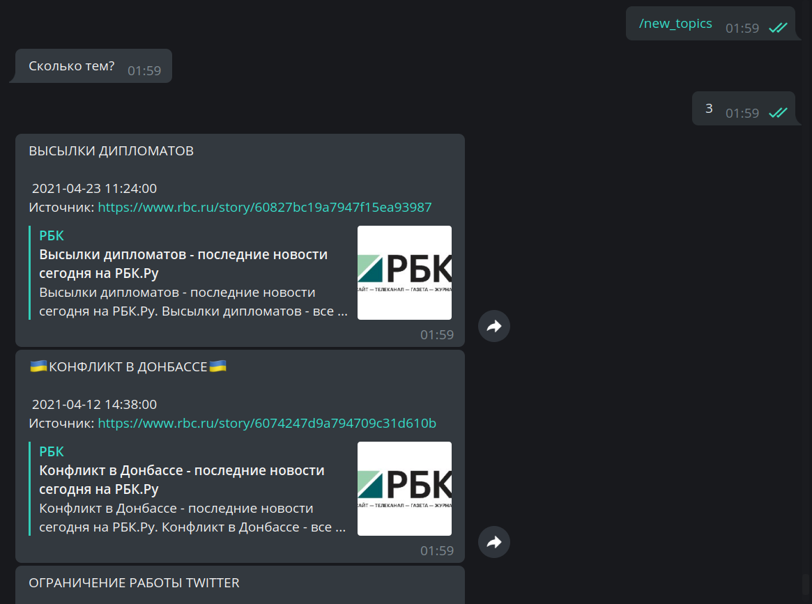
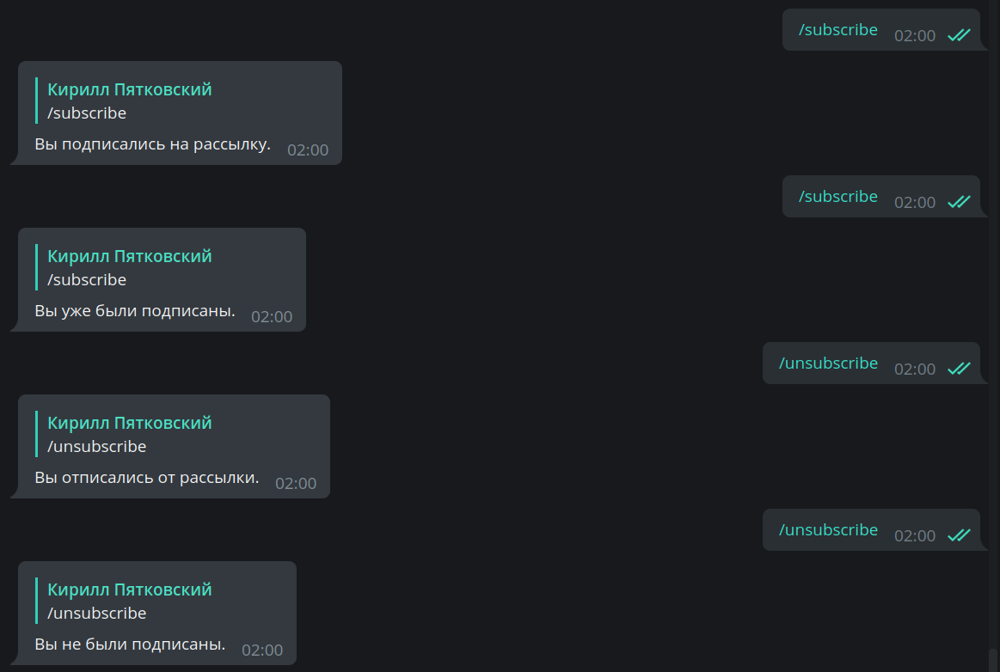

## NewsParser_bot
`TG: @RBC_NewsParser_bot`

Телеграмм-бот, занимающийся парсингом сайта https://www.rbc.ru/story/

Бот использует две базы данных:
**rbc_stories.db** - БД с темами и статьями сайта;

**rbc_bot_users.db** - БД с пользователями бота и статусом их подписки.

## **Команды бота:**

`/start` - вывести приветствие и описание бота.

`/help` - получить список всех возможных команд.

`/new_docs` - показать [N] самых свежих новостей.

`/new_topics` - показать [N] самых свежих тем.

`/get_topics` - получить список всех тем в базе.

`/get_docs` _<Номер/Название>_ - получить список всех новостей в данной теме.

`/topic` _<Номер/Название>_ - показать заголовки 5 самых свежих новостей в этой теме.

`/doc` _<Номер/Название>_ - показать текст документа с заданным заголовком.

`/describe_doc` _<Номер/Название>_ - получить статистику по новости.

`/subscribe` - Подписаться на ежечасную рассылку новостей.

`/unsubscribe` - Отписаться от ежечасной рассылки новостей.

## **Как пользоваться?**
1. Открываем Телеграмм
2. В поисковой строке набираем @RBC_NewsParser_bot
3. Пишем /start

## **Как запустить такого бота у себя?**
1. Открываем или создаём проект
2. Вставляем в терминал `git clone https://github.com/kirixh/PythonReview_NewsParser_bot.git -b dev`
3. Находим в Телеграмме @BotFather
4. Пишем /newbot, следуем инструкциям
5. Получив уникальный токен, вставляем его в 10 строке файла bot.py вместо "TOKEN"
6. Кликаем ПКМ -> Run 'bot'

## **Пример использования бота**

